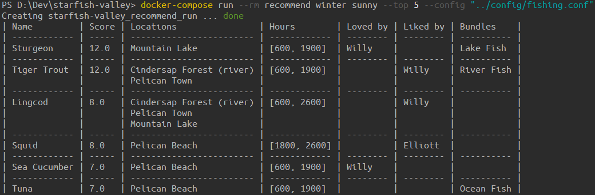

# Starfish Valley: Stardew Valley Fishing Recommender

Do you ever wake up in a morning, want to go fishing, but cannot decide _where_ to go?

Starfish Valley is here to help you.

Simply tell it the season and weather of the day and it will recommend you fish to catch!



## Project status

* I intend to make a web UI, but I also want to spend time actually playing the game,
  so for now there is only a command line tool.
* I didn't localize the location names because I couldn't find them in game data files.
* Suggestions and contributions are welcome.

## Usage

### Prerequisites

This project uses Docker to run Python.
You should be able to get away with not using Docker if you really don't want it,
but you'll need to manage virtual environments and dependencies yourself.

To build the recommender image, simply run:

```bash
docker-compose build
```

### Configuration

NOTE: THERE ARE __SPOILERS__ IN THE CONFIGURATION FILE!

Go to [`recommend/config`](recommend/config) and copy [`template.conf`](recommend/config/template.conf) to `recommend.conf`.
You may keep multiple `conf` files in case you want to switch between configurations,
and you'll be able to specify a config file in the command line.

Follow the instructions in the config file and it should be pretty straightforward.

### Run

```bash
docker-compose run --rm recommend {season} {weather}
```

To see help information and additional arguments you may use:

```bash
docker-compose run --rm recommend --help
```

If you don't want to spin up a container every time, you may run

```bash
docker-compose run --rm --entrypoint="" recommend bash
```

and then run `main.py` inside:

```bash
python main.py {season} {weather}
```

## Update game data

See [`prepare-data/README.md`](prepare-data/README.md).
